## {.full-image .label-bottom background-image="figures/jeppes-reef.png" background-size="cover" background-position="center"}

::: {.full-image-label}
The Matsamo border post at Jeppes Reef, Eswatini. Image: Wikimedia Commons
:::

::: {.notes}
On the sixth of March, 2020, a nurse in a white coat raised a thermometer to my forehead at a border post in Eswatini and wrote my name --- by hand --- in a small ledger.

This is that border post: Matsamo, near the town of Jeppes Reef. Eswatini is a small, landlocked kingdom in southern Africa --- larger than Connecticut but smaller than New Jersey --- a country of mountains and forests, sugar fields and sawmills, where trade and agriculture remain the backbone of daily life for its 1.2 million people.

I crossed into Eswatini that day on my way to Johannesburg for a flight home after a conference in Kruger National Park. The border post was relatively quiet --- a long roof built to clear lorries, a row of low offices painted red, a handful of travelers waiting in the heat.

When my turn came, the nurse took my temperature and recorded my name in her ledger. It was an earnest, improvised gesture of vigilance at the very moment global air traffic was days away from collapsing. What, realistically, could that notebook do?

And yet that moment captures something essential. It was a prelude to the weeks ahead: a collision between local resolve and a world already woven together by dense networks of mobility. The thermometer, the pencil, and the ledger are a metaphor for the limits of localized response in an era when pathogens move at the speed of global systems. That tension --- between the intimate and the planetary --- is the thread running through this entire talk, and through the book it comes from.

[1.8 min | ends ~2:18]
:::

## A world poised on edge {.figure}

:::: {.columns}

::: {.column width="55%"}
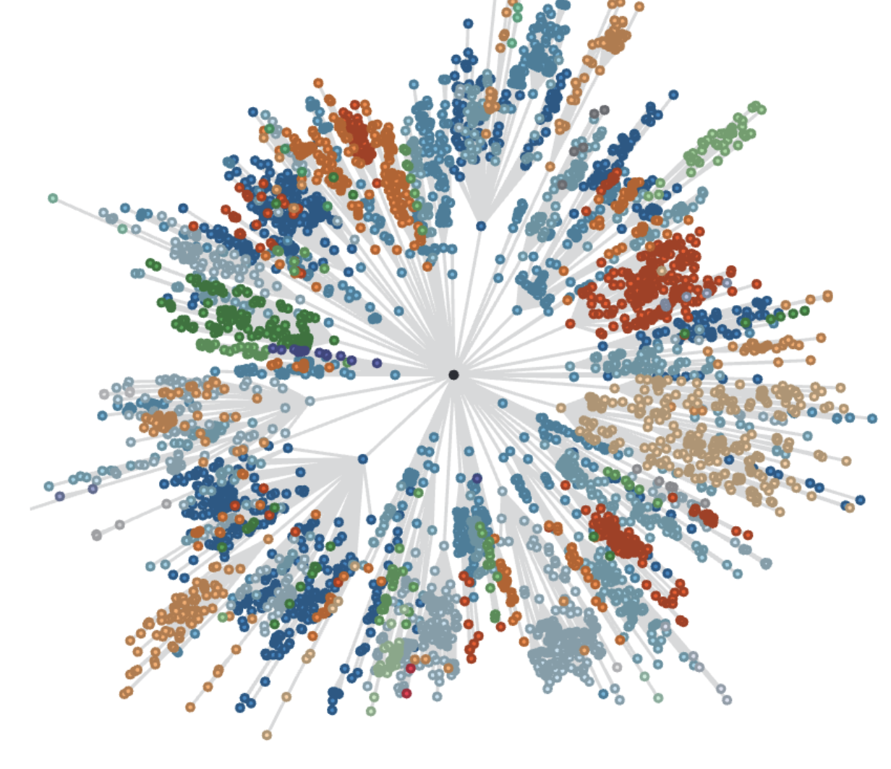{fig-align="center" height="440"}
:::

::: {.column width="45%"}
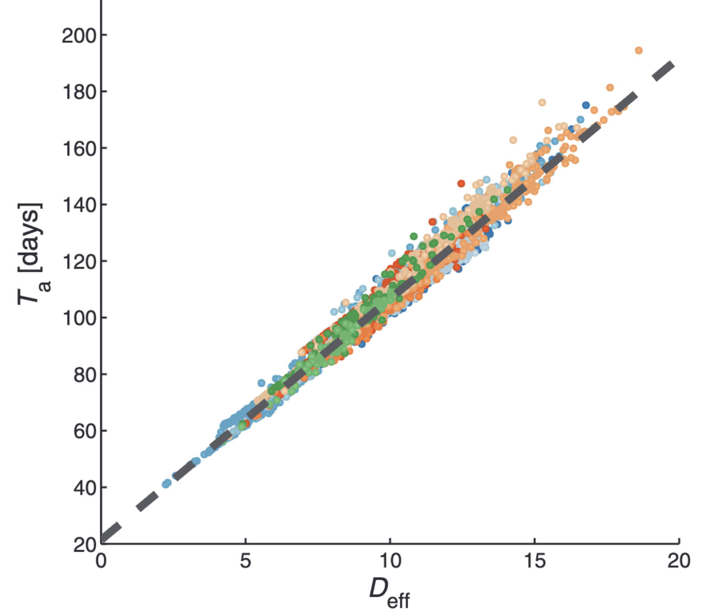{fig-align="center" height="440"}
:::

::::

Left: the shortest-path network from Hong Kong to 4,069 world airports. Right: epidemic arrival time is almost perfectly linear in *effective distance* on that network. Source: Brockmann & Helbing (2013) *Science* 342: 1337--1342.

::: {.notes}
Why couldn't the ledger work? Because by 2020, the basic geometry of risk had changed.

In 2013, Dirk Brockmann and Dirk Helbing demonstrated this with unusual clarity. Using global airline data, they showed that contagion in a connected world follows effective distance, not geographic distance. Cities separated by thousands of kilometers may be only one or two "steps" apart in terms of mobility flux. On this map, the distance from Hong Kong to London is not ten thousand kilometers; it is one step.

When SARS-CoV-2 emerged, it was a probe revealing the structural properties of a hyperconnected world. Its rapid spread was not the failure of any single sector --- not health, nor transportation, nor governance --- but the signature of a tightly coupled system in which local shocks are transmitted quickly and widely.

The lesson is not that globalization is inherently risky, but that certain forms of connectivity transform the kinds of risks we face. That is the claim I want to develop today.

*But before we go further, we should pause on a deceptively simple question.*

[1.2 min | ends ~3:29]
:::

## What is a pandemic?

**Etymological** --- *pan* + *demos*: a disease "of all the people"

**Epidemiological** --- outbreak → epidemic → pandemic: scale, distribution, sustained transmission

**Institutional** --- the PHEIC: "an extraordinary event which constitutes a public health risk to other states through the international spread of disease"

::: {.notes}
What is a pandemic? We use the term casually, but its meaning is not stable. It sits at the intersection of language, epidemiology, and politics --- which is why I want to dwell on it for a moment.

Etymologically, the word comes from Greek: demos --- the people --- and pan --- all. A pandemic is, literally, a disease "of all the people."

In epidemiology, we define the terms outbreak, epidemic, and pandemic by scale: an outbreak is local and short-lived; an epidemic involves sustained transmission and demands a public health response; a pandemic crosses national or continental boundaries and requires international coordination. But the categories are porous --- there is no consensus on when an epidemic becomes a pandemic. The transition is less a scientific boundary than a shift in recognition: the moment when "their problem" becomes "our problem."

To formalize that recognition, we built institutions. The most important is the Public Health Emergency of International Concern, created in the 2005 revision of the International Health Regulations. In principle a PHEIC is an alarm bell. In practice it is also political: declaring one can move markets, close borders, and reshape diplomatic relationships. It has been invoked only nine times --- for H1N1, polio, Ebola three times, most recently for the current outbreak in the Democratic Republic of the Congo, Zika, COVID-19, and mpox twice. Each declaration is a negotiation between evidence and consequence.

So a pandemic is not just when a disease goes global. It is when we can no longer deny our interconnectedness. Naming is a form of power: it defines responsibility, visibility, and urgency.

[1.8 min | ends ~5:16]
:::

# A century of pandemics {.divider}

::: {.notes}
*So let's look at the record. What have the pandemics of the last hundred years actually been like?*

[0.1 min | ends ~5:23]
:::

## {.full-image .label-title background-image="figures/camp-funston.png" background-size="cover" background-position="center"}

::: {.full-image-label}
Emergency hospital during the influenza pandemic, Camp Funston, Kansas

[Image: Wikimedia Commons]{.credit}
:::

::: {.notes}
Almost every history of modern pandemics begins here. In the spring of 1918, an unusual influenza A virus --- an H1N1 --- began circulating among military camps in the United States and Europe, just as the armies of the First World War were mobilizing for their final campaigns. That designation, H1N1, refers to the two proteins studding the surface of the virus: hemagglutinin, which lets the virus enter a cell, and neuraminidase, which lets new copies escape it --- and each comes in many subtypes, most of them circulating in wild birds. Because the influenza genome is carried on eight separate segments, two viruses infecting the same host can shuffle those segments and produce something entirely new --- a process called reassortment, and it runs through this whole history.

The first wave caused extensive illness but modest mortality. Then, beginning in August 1918, a far more lethal second wave swept cities across four continents, and a third wave followed in 1919.

The origin of the 1918 virus remains unresolved, but the scale of mortality was unprecedented. An estimated 500 million people --- one-third of the global population at the time --- were infected, and 50 to 100 million died. In the United States, life expectancy fell by more than twelve years in a single year, the steepest decline ever recorded.

For our purposes, 1918 stands as the benchmark for global infectious-disease shocks: extraordinary spatial reach, rapid transcontinental spread accelerated by wartime troop movements, multiple waves, and profound demographic and social disruption. It marks the moment when global interconnection --- military, economic, and political --- made it possible for a local virus to become a global catastrophe.

[1.9 min | ends ~7:14]
:::

## Influenza dominated the pandemic century --- and our expectations {.smaller}

| Event | Origin and route |
|---|---|
| **Influenza A H1N1, 1918--20** | **Animal-related; spread with WWI troop movements** |
| **Influenza A H2N2, 1957--58** | **China; wild birds → poultry/pigs → humans** |
| Cholera (El Tor), 1961-- | Indonesia; food and water; ballast-water spread |
| **Influenza A H3N2, 1968--70** | **Hong Kong; birds → livestock → humans** |
| **Influenza A H1N1, 1977--78** | **Probable laboratory or vaccine release** |
| HIV/AIDS, 1981-- | Central Africa; primate spillovers → global travel |
| SARS, 2002--03 | Guangdong; wildlife farming and live-animal markets |
| **Influenza A H1N1pdm09, 2009--10** | **Mexico; reassortment in industrial pig farms** |
| Zika, 2007--17 | Africa/Asia; urbanization and *Aedes* mosquitoes |
| COVID-19, 2019-- | Wuhan; wildlife trade or possible lab release |
| Mpox, 2022--23 | West/Central Africa; spillover from wild rodents |

::: {.notes}
Here is the pandemic record of the twentieth and twenty-first centuries --- eleven major events. I want to read this list three times, through three different lenses.

First lens: influenza. Depending on classification, five of these eleven were influenza A events. This historical pattern shaped expectations. For decades, most preparedness planning --- from WHO frameworks to national stockpiles --- assumed the next major pandemic would be influenza. Each of these flu pandemics arose by reassortment, usually in agricultural or mixed-animal systems where viruses from birds, pigs, and people meet. Nineteen fifty-seven emerged in southern China from an avian-human reassortment; 1968 in Hong Kong by a similar process; 2009 from decades of viral mixing in globally traded pigs.

But this focus created a kind of tunnel vision. It reflected the pathogens we had already seen rather than the processes driving emergence. COVID-19 was the reminder that pandemic risk is not limited to influenza --- that our models of "the next big one" are often constrained by historical memory rather than structural analysis.

[1.1 min | ends ~8:23]
:::

## Nine of eleven trace to food, agriculture, or water {.smaller}

| Event | Origin and route |
|---|---|
| **Influenza A H1N1, 1918--20** | **Animal-related; spread with WWI troop movements** |
| **Influenza A H2N2, 1957--58** | **China; wild birds → poultry/pigs → humans** |
| **Cholera (El Tor), 1961--** | **Indonesia; food and water; ballast-water spread** |
| **Influenza A H3N2, 1968--70** | **Hong Kong; birds → livestock → humans** |
| Influenza A H1N1, 1977--78 | Probable laboratory or vaccine release |
| HIV/AIDS, 1981-- | Central Africa; primate spillovers → global travel |
| **SARS, 2002--03** | **Guangdong; wildlife farming and live-animal markets** |
| **Influenza A H1N1pdm09, 2009--10** | **Mexico; reassortment in industrial pig farms** |
| Zika, 2007--17 | Africa/Asia; urbanization and *Aedes* mosquitoes |
| **COVID-19, 2019--** | **Wuhan; wildlife trade or possible lab release** |
| **Mpox, 2022--23** | **West/Central Africa; spillover from wild rodents** |

::: {.notes}
Second lens: origins. Pathogens do not appear in a vacuum. Across these eleven pandemics, nine have clear associations with food, agriculture, or water. The conditions under which humanity feeds itself, extracts resources, and organizes production create the ecological interfaces where novel pathogens evolve, spill over, and spread.

SARS emerged from the live-animal markets of southern China --- civets and raccoon dogs, farmed for food, infected with coronaviruses derived from horseshoe bats; forty percent of the earliest human cases had occupational exposure to wildlife handling. COVID-19, two decades later, plausibly reflects the same structure --- though a laboratory-associated origin cannot be fully excluded on current evidence.

Cholera --- the only major bacterial pandemic of the period --- reflects a different ecology but the same principle: the seventh pandemic began in Indonesia in 1961 and spread via maritime trade, entering human populations through contaminated water and seafood. And mpox spills over through contact with rodents hunted or prepared as food --- with one American outbreak, in 2003, arriving instead through the exotic pet trade.

The through-line is that pandemics are downstream consequences of how societies produce food, structure trade, and interact with animals.

[1.3 min | ends ~9:39]
:::

## Pandemics spread along the corridors of the global economy {.smaller}

| Event | Origin and route |
|---|---|
| **Influenza A H1N1, 1918--20** | **Spread with WWI troop and transport routes** |
| **Influenza A H2N2, 1957--58** | **Encircled the globe with early commercial aviation** |
| **Cholera (El Tor), 1961--** | **Reached Latin America 1991 via ballast water → IMO Convention (2004)** |
| **Influenza A H3N2, 1968--70** | **Spread in step with the jet age** |
| Influenza A H1N1, 1977--78 | Probable laboratory or vaccine release |
| **HIV/AIDS, 1981--** | **Amplified by labor mobility and international travel** |
| **SARS, 2002--03** | **One hotel floor → three continents in days** |
| **Influenza A H1N1pdm09, 2009--10** | **Global pig trade, then global air travel** |
| **Zika, 2007--17** | **Travel + invasive vectors across the Pacific and Americas** |
| **COVID-19, 2019--** | **The full global aviation network** |
| **Mpox, 2022--23** | **International travel networks; 2003 via pet trade** |

::: {.notes}
Third lens: spread. Nearly all modern pandemics have moved along the very corridors that connect the global economy.

For respiratory pathogens, international mobility is an accelerant. In 1918, influenza followed troop and transport routes to every inhabited continent within months. The later influenza pandemics spread in step with commercial aviation, each encircling the globe within weeks. SARS in 2003, and SARS-CoV-2 two decades later, followed the same pattern: local zoonotic emergence amplified through international air travel.

But trade moves pathogens with equal force --- sometimes without moving infected people at all. Cholera's modern spread, from Indonesia to Latin America, followed shipping routes and ballast-water discharge --- and prompted an international legal response, the IMO Ballast Water Convention. The 2003 U.S. mpox outbreak traced to imported rodents in the exotic-pet trade.

One more row deserves a sentence: the 1977 H1N1 event, almost genetically identical to viruses from the 1950s, almost certainly escaped from a laboratory or vaccine-production setting. As bioscience globalizes, laboratory risk globalizes with it --- a governance frontier I'm happy to return to in questions.

Across all three lenses, a single theme: pandemic spread is not random. It is structured by the same networks --- of people, goods, and animals --- that constitute the architecture of globalization itself.

[1.4 min | ends ~11:04]
:::

## Pandemics rival the great economic shocks of the modern era {.figure}

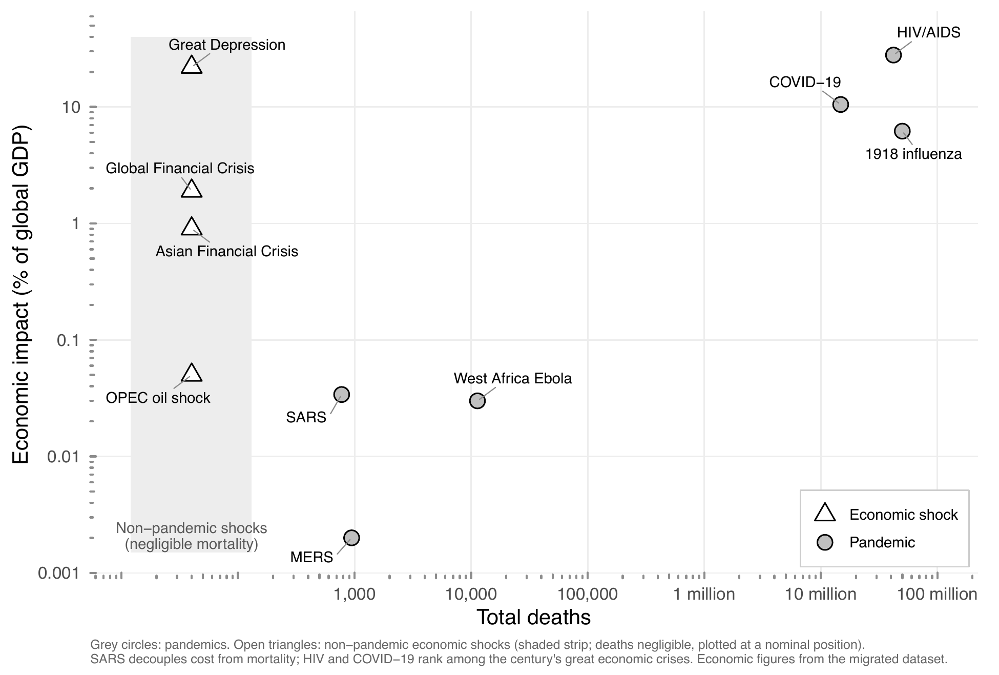{fig-align="center" height="460"}

Economic impact as a share of world output against total deaths for the century's pandemics, with the era's major non-pandemic economic shocks (open triangles) for comparison.

::: {.notes}
One more pattern from the historical record, from an analysis of my own for the book. This figure places the century's pandemics on the same axes as its great economic shocks: economic impact as a share of world output, against total deaths. The point is that pandemics rival the defining economic crises of the modern era. COVID-19's toll approached a tenth of world output in a single year, and the cumulative burden of HIV/AIDS rivals the Great Depression. Pandemics belong on the same page as financial crises and oil shocks --- and sometimes at the top of it.

[0.7 min]
:::

# From events to system {.divider}

::: {.notes}
*Eleven pandemics give us a pattern --- but eleven events cannot give us an explanation. For that, we have to widen the frame.*

[0.2 min | ends ~11:13]
:::

## Emergence is caused by human action

> "Most emerging infections appear to be caused by pathogens already present in the environment, brought out of obscurity or given a selective advantage by changing conditions and afforded an opportunity to infect new host populations... Surprisingly often, disease emergence is caused by human actions, however inadvertently."

Morse, S.S. (1995) "Factors in the emergence of infectious diseases," *Emerging Infectious Diseases* 1: 7--15.

::: {.notes}
Ultimately, we want to know whether these modern pandemics share genuine through-lines. But pandemics are statistically scarce --- a dozen events in a century can hint at patterns, but they cannot, on their own, explain why new pathogens emerge.

So the key move is to widen the frame: to see pandemics as the visible peaks of a much larger landscape of emergence --- one that includes several hundred documented emerging infectious disease events over recent decades. And this framing is not new. Stephen Morse, virologist at Rockefeller University and co-chair of the influential 1992 Institute of Medicine committee, wrote this in the inaugural issue of the CDC journal Emerging Infectious Diseases, in 1995: most emerging infections are caused by pathogens already present in the environment, given their opportunity by changing conditions --- and surprisingly often, that change is human action.

That sentence was written thirty years ago, and the field has repeated it ever since: disease emergence is caused by human action. But the observation has never really been cashed out. What exactly is that human action? Through what channels does it operate? And how does the commonality running beneath these hundreds of emergences help us understand pandemics? Nobody has worked that through --- and doing so is the aim of my book, and of the rest of this talk.

[1.2 min | ends ~12:23]
:::

## Emergence is a measurable global process {.figure}

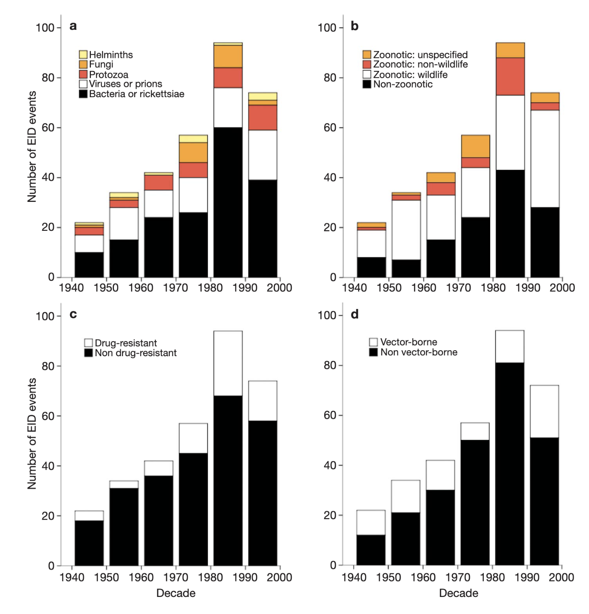{fig-align="center" height="440"}

Jones et al. compiled 335 emerging-disease events, 1940--2004: the majority zoonotic, clustered where demographic growth, land-use change, and economic integration accumulate.

Jones, K.E. et al. (2008) "Global trends in emerging infectious diseases," *Nature* 451: 990--993.

::: {.notes}
A landmark in the shift from qualitative insight to quantitative global analysis was the Nature paper by Kate Jones and colleagues in 2008 --- an early systematic attempt to treat emerging infectious diseases not as anecdotes but as data.

Jones and her team compiled more than 300 emergence events from 1940 to 2004. Three findings stand out. First, the temporal signal: events rose steadily to a peak in the 1980s. Second, the biological pattern: about sixty percent were zoonotic --- and of those, most came from wildlife rather than livestock, mirroring the pandemic history we just reviewed. Third, the geographic pattern: emergence was not random. Events clustered in regions undergoing rapid demographic growth, land-use change, agricultural intensification, and economic integration.

The key contribution was conceptual as much as empirical: emerging infectious diseases form a measurable global process. They arise where human-driven ecological and social changes accumulate --- an early empirical bridge between emergence and the broader architecture of globalization.

[1.1 min | ends ~13:27]
:::

## The list of "drivers" keeps growing --- and that is the point

**1992 IOM report:** 6 factors --- microbial adaptation; demographics and behavior; economic development and land use; travel and commerce; technology and industry; breakdown of public health

**2003 IOM report:** 13 factors --- adding climate, ecosystems, poverty and inequality, war and famine, political will, intent to harm...

**Stephens et al. 2021:** 48 factors in 9 categories

::: {.notes}
If we want a more complete theory of emergence, we need the structural processes behind it. An early attempt came from the Institute of Medicine's 1992 report, which identified six precipitating factors --- among them demographic change, land use, international travel and commerce, and the erosion of public health capacity. What stands out today is how clearly it framed emerging infections as products of human systems --- not mysterious shocks, but predictable outcomes.

A decade later, the IOM returned to the question, and the list had grown to thirteen --- adding climate, poverty and inequality, war, state capacity, even deliberate release. The deeper shift was conceptual: where 1992 treated the drivers as separate influences, 2003 described them as interdependent forces in a rapidly changing global environment.

And when my colleagues and I examined the question empirically --- in a working group at the Center for the Ecology of Infectious Diseases here at UGA --- we catalogued forty-eight characteristics in nine categories across the largest modern zoonotic outbreaks. The proliferation is the finding: no single factor reliably predicts outbreak size. Emergence reflects combinatorial, multi-domain interactions that differ from one event to the next.

[1.3 min | ends ~14:44]
:::

## No single driver predicts outbreak size {.figure}

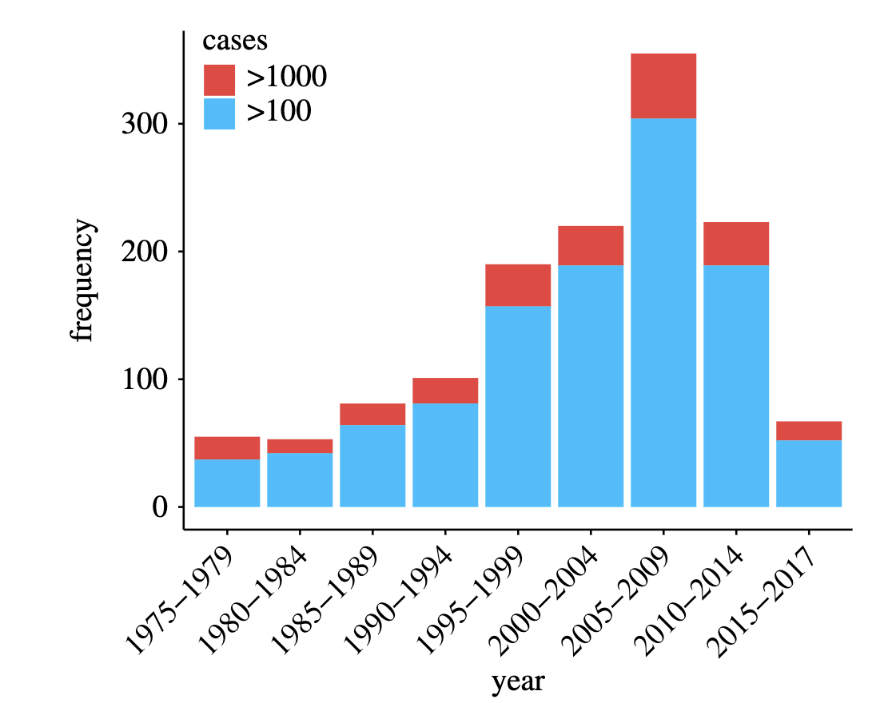{fig-align="center" height="420"}

Across the 100 largest zoonotic outbreaks since 1974, large events involved *more* drivers than background outbreaks --- vector abundance, population density, unusual weather, water contamination --- in outbreak-specific combinations.

Stephens, P.R. et al. (2021) *Phil. Trans. R. Soc. B* 376: 20200535.

::: {.notes}
Here is that analysis of the hundred largest modern zoonotic outbreaks. What emerges is not simplicity but structure. Large outbreaks tended to have more drivers than background outbreaks, and they were related to large-scale environmental and demographic factors: changes in vector abundance, human population density, unusual weather, water contamination. The pathogens of large outbreaks were more likely to be viral and vector-borne.

Crucially, these characteristics do not align into a single causal sequence. They form a many-to-many architecture: each outbreak involves a different subset of factors, and no single driver --- or even small cluster of drivers --- consistently predicts size. This is complexity in the rigorous sense: emergence arises from combinatorial interactions across domains, not from universal pathways.

So the findings undermine the search for a single causal narrative --- and they point decisively toward a systems-level explanation. To build one, we have to step back and name the system. The factors we list as "drivers" --- land-use change, mobility, trade --- are themselves downstream expressions of a much broader transformation: the globalization of human activity, and the extraordinary growth that accompanied it.

[1.2 min | ends ~15:57]
:::

# Globalization and growth {.transition}

::: {.notes}
*So what is this system that keeps producing new diseases? To answer that, we need to talk about globalization --- and about the extraordinary growth that drove it.*

[0.2 min | ends ~16:08]
:::

## Globalization is the intensification of worldwide social relations

> "Globalization can... be defined as the intensification of worldwide social relations which link distant localities in such a way that local happenings are shaped by events occurring many miles away and vice versa."

Anthony Giddens (1990) *The Consequences of Modernity*

::: {.notes}
So: what do we mean by globalization? It's a word that has been asked to carry so much freight it sometimes collapses under the load. In writing this book, I have been tuning into two very different literatures that use this same word and rarely read each other: a sociological literature, and an economic one. Globalization is a concept in tension --- there is no unique authority to appeal to for its meaning --- and part of the work of the book is holding the two traditions in one frame.

The sociological tradition begins with Anthony Giddens, writing in 1990 --- before the commercial internet, before anyone spoke of a "global supply chain": globalization is the intensification of worldwide social relations which link distant localities in such a way that local happenings are shaped by events occurring many miles away, and vice versa.

"Local happenings." A cluster of unusual pneumonia in Wuhan in the last weeks of 2019 became, within a year, shuttered schools in Ohio, refrigerated trucks behind the hospitals of Bergamo, and an empty Times Square. Giddens wrote that definition about nothing in particular; COVID-19 made it concrete for everyone at once.

Through the 1990s the word narrowed in the public mind to open markets and neoliberal trade policy --- the economists' sense of the term. The sociologists said at the time that this narrowing was a mistake: globalization is expressed in all the key domains of social activity --- political and cultural as much as economic. That wider view is the one I take: globalization is real and consequential, but neither complete nor inevitable --- a historically contingent reordering of how social life is stretched across space.

*That is the sociologists' globalization. The economists tell a different story --- and it begins with history, because globalization has gone into reverse before.*

[1.5 min | ends ~17:40]
:::

## Globalization comes in waves --- and has reversed before {.figure}

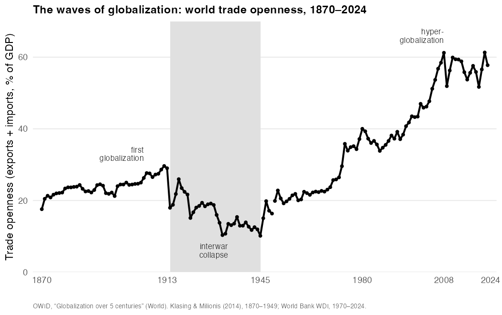{fig-align="center" height="440"}

World trade openness, 1870--2024. The interwar collapse --- trade falling from a fifth of world output to a tenth --- is the empirical refutation of any claim that globalization is inevitable.

::: {.notes}
Here the economic historians take over from the sociologists, and their globalization is a different creature: measured in prices and flows, and anything but a smooth ascent.

An early and instructive episode of biological globalization came in 1492, when Columbus's ships closed the ten-thousand-year separation between the hemispheres --- the Columbian Exchange. Maize and potatoes crossed east and fed Europe's rise; smallpox, measles, and influenza crossed west into populations with no immunity, and killed on a scale still difficult to comprehend. At the very start of the story, the pattern this book documents: connection distributes opportunity and pathogen along the same routes, and seldom to the same people.

Economic globalization came later. Between 1870 and 1914, the steamship, railway, and telegraph produced a first great age: capital flowed under the gold standard, sixty million Europeans emigrated, and trade climbed toward a fifth of world output. Into this integrated world the 1918 influenza erupted.

Then the world pulled back. Two world wars, tariff walls, and the Depression produced the great deglobalization of 1914 to 1945 --- trade fell back to a tenth of world output.

The recovery came in two stages --- Bretton Woods after 1945, then, after 1980, a hyperactive phase that dwarfed the first wave. And that modern wave did not integrate the world evenly. Immanuel Wallerstein described a core and a periphery --- a wealthy, capital-exporting center and a resource-supplying margin. The split maps onto disease: the frontiers where new pathogens emerge lie overwhelmingly in the periphery; the capacity to make and hoard vaccines lies in the core.

[1.7 min | ends ~19:22]
:::

## For most of history, there was no growth at all {.figure}

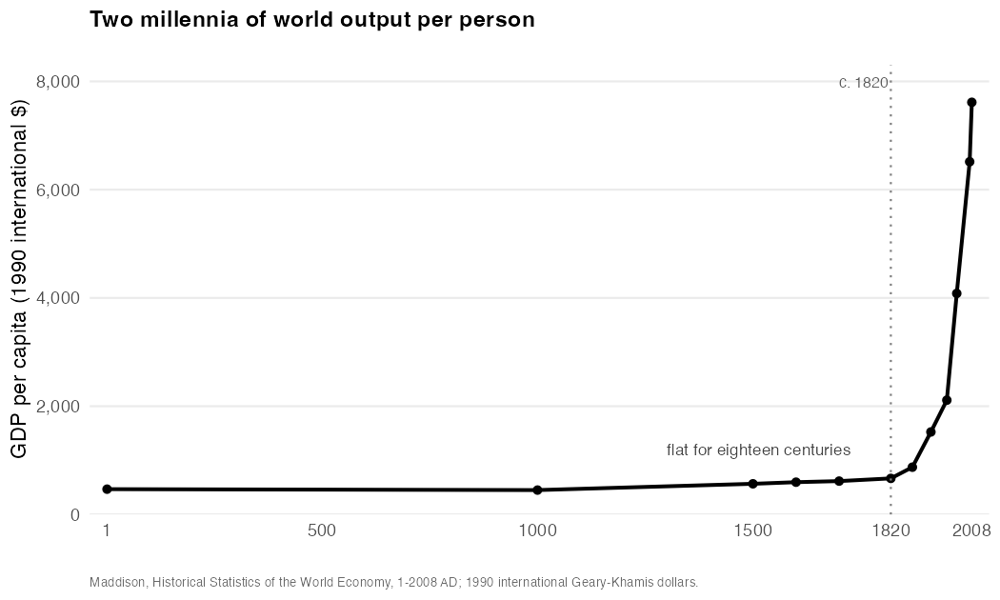{fig-align="center" height="440"}

Global GDP per capita over two millennia: essentially flat for all of recorded history, then a near-vertical ascent beginning around 1800.

Daniel Susskind (2024) *Growth: A History and a Reckoning*

::: {.notes}
Globalization and economic growth are not the same thing, but they are wound together so tightly they are easily confused. To see why, look first at the sheer scale of the growth --- whose strangeness is easy to miss from inside it.

In his book Growth: A History and a Reckoning, the economist Daniel Susskind assembles the numbers, and they are startling. Real wages in England barely moved for six centuries --- a person in 1800 was scarcely better off than an ancestor in 1200. Then, around 1800, they began to climb, and have since risen roughly twelvefold. Global output per person tells the same story on a longer axis: broadly flat for millennia, then a near-vertical ascent to something like fifteen times its pre-industrial level.

Nearly all of the wealth that has ever existed was made in the last two hundred years. The question that occupied economics for a century is: what broke the stagnation?

[1.1 min | ends ~20:30]
:::

## What broke the stagnation: ideas that don't run out

**Solow (1956)** --- growth cannot be explained by labor and capital alone; most of it is a *residual*: technology

**Romer (1990)** --- the residual explained: ideas are *nonrival* and *cumulative* --- usable by everyone at once, combinable forever

**Mokyr** --- the recipes needed a culture willing to cook: the spread of a scientific mentality

::: {.notes}
The proximate answer is technological progress. Robert Solow showed in the 1950s that the growth of rich economies could not be explained by adding more labor and more capital --- most of it came from a residual he identified with technology: the recipes by which inputs are turned into outputs. But Solow left the recipes falling from the sky.

It was Paul Romer, decades later, who brought them inside the model --- and identified what makes ideas such peculiar engines of growth. Ideas are nonrival: usable by everyone at once without being used up. And they are cumulative: a theorem proved once is available forever, and can be combined with other ideas to make more. Unlike coal or land, ideas do not run out. That is why growth, once it started, could compound.

And the recipes needed a culture willing to cook. Joel Mokyr argues that what tipped Europe into sustained growth was a new mentality --- a conviction that the natural world held a hidden order careful experiment could uncover. The same coal and iron sat unused for centuries before a culture arose that knew what to do with them.

Once raising GDP became an explicit objective of policy, the productive potential of those ideas was fully unleashed --- and trade liberalization was one of the chief instruments of the unleashing.

[1.5 min | ends ~21:59]
:::

## Trade was the unleashing --- comparative advantage, with caveats

**Ricardo (1817)** --- England and Portugal, cloth and wine: specialization and exchange leave *both* parties richer, even when one is better at everything

**The evidence** --- openness helps growth, but by less, and under more conditions, than the boosters claimed

::: {.notes}
The intellectual justification for trade as an engine of growth is comparative advantage --- David Ricardo's demonstration, in 1817, that economic actors do best to specialize in whatever they can produce at the lowest opportunity cost, even when a trading partner is better at everything in absolute terms. His illustration was England and Portugal, cloth and wine. Portugal could make both with less labor than England --- and yet both countries came out richer if Portugal made only wine, England only cloth, and each bought the other across the water. Absolute skill was beside the point; what mattered was what each side had to give up.

Economists count comparative advantage among the deepest results in their field --- and yet its empirical record is muddier than its logic. In the 1990s, Sachs and Warner produced influential evidence that open economies grew markedly faster than closed ones; Rodríguez and Rodrik then took the finding apart, showing much of the effect came from other troubles bundled into the "openness" index. My reading: trade openness helps growth, but by less, and under more conditions, than the triumphalist version of the 1990s allowed --- a real effect, not a magic one, and one that depends heavily on the institutions a country already has.

[1.5 min | ends ~23:28]
:::

## The four flows, measured {.figure}

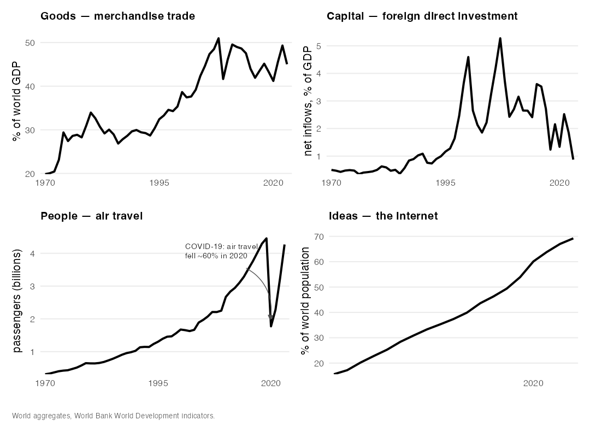{fig-align="center" height="440"}

Goods, capital, people, and ideas have all intensified their movement across borders --- the measurable substance behind the abstraction of "interconnection." The one sharp reversal: air travel collapsed by ~60% in 2020, then recovered within three years.

::: {.notes}
So growth and globalization fed each other. And we can measure the result. To a first approximation, everything that flows through the web of globalization is one of four things: goods and services, capital, people, and ideas. Here are quantified examples of all four: trade, foreign investment, travel, and the movement of information, all rising to levels without precedent in the decades after 1970.

I want to draw your attention to two things in particular. First, these series can be read in two ways --- what the KOF Globalisation Index calls de facto globalization, the observed flows themselves, and de jure globalization, the treaties, policies, and institutional arrangements that enable them. Both rose together. The flows are not natural phenomena; they are legal and economic constructions.

Second, the people panel: global air travel collapsed by roughly sixty percent in 2020 as the pandemic closed borders, then recovered within three years. That dip is the feedback loop made visible --- the pandemic briefly threw globalization's people-flow into reverse. I want to hold on to that thought; it comes back at the end of the argument.

[1.1 min | ends ~24:36]
:::

## The reckoning: growth's two unpaid debts {.figure}

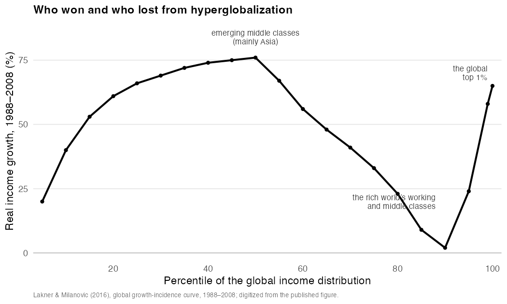{fig-align="center" height="420"}

The "elephant curve": real income growth 1988--2008 by percentile of the global income distribution. Asia's emerging middle classes and the global top 1% gained most; the rich world's working classes fell behind in relative terms.

Milanovic (2018); Susskind (2024)

::: {.notes}
But the growth, however achieved, came at a cost its beneficiaries were slow to count. This is the "reckoning" of Susskind's subtitle: the same technologies that lifted billions out of poverty have also been, in his phrase, climate-destroying, inequality-creating, work-threatening, politics-undermining, and community-disrupting.

Two of those debts bear directly on infectious disease. The first is environmental: much of the century's growth was financed by drawing down natural capital --- forests, fisheries, soils, the atmosphere --- precisely the disturbances that remake the human-animal interface where new pathogens cross over.

The second is distributional. This is Branko Milanovic's elephant curve: every person on earth lined up from poorest to richest, and each group's real income growth from 1988 to 2008. The rising back is Asia's emerging middle class --- gains of seventy, eighty percent. The soaring trunk-tip is the global top one percent. The sagging point near the ninetieth percentile is the rich world's working and middle class, who gained least.

And the unevenness has epidemiological consequences. During COVID, the economist Mushfiq Mobarak re-ran the models steering Western lockdown policy with the demography and economics of Bangladesh, Nigeria, and Ghana --- and the answer changed. In a young country with few hospital beds, lockdown saves fewer lives, and a day-laborer who stays home does not eat that week. Lockdown, it turns out, is something close to a luxury good. When vaccines arrived, the story repeated: across fifteen low- and middle-income countries, willingness to take the vaccine was higher than in the United States. Hesitancy was not the bottleneck --- access was. Where in the world economy a person is born determines what a pandemic does to them.

[1.8 min | ends ~26:26]
:::

## Growth and globalization are a self-reinforcing pair {.figure}

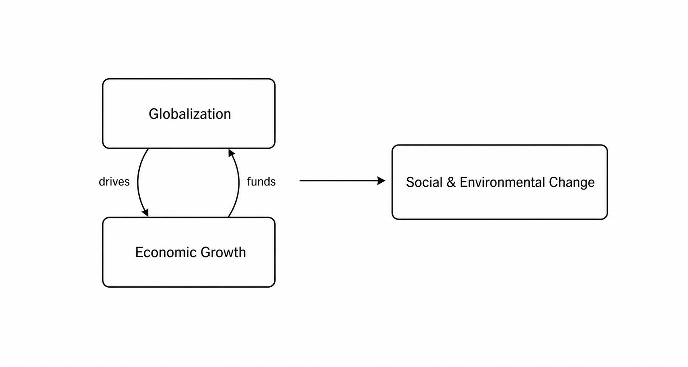{fig-align="center" height="420"}

The basic model: globalization and growth drive one another, and their joint output is a wave of social and environmental change.

::: {.notes}
Let me compress all of that into one picture --- the basic model of the book.

Globalization and growth form a self-reinforcing pair. Growth expands trade, investment, mobility, and the production of ideas; those flows, in turn, feed growth. And the joint output of the pair is a wave of social and environmental change --- land conversion, urbanization, climate disruption, agricultural intensification --- at a pace and scale without precedent in human history.

That wave is where disease enters.

[0.7 min | ends ~27:09]
:::

# The globalization grid {.transition}

::: {.notes}
*But to see exactly where, we need to be more precise about the machinery of globalization itself --- and that brings me to the conceptual center of the talk.*

[0.2 min | ends ~27:18]
:::

## Four means, three domains

**The means** --- what moves: **goods & services**, **capital**, **people**, **ideas**

**The domains** --- what it moves through: **economic**, **political**, **cultural**

Each flow is also a *vector* --- carrying disease along the same channels it opens for everything else

::: {.notes}
This is where I try to bring the two literatures together --- the economists' measurable flows and the sociologists' domains of social life --- in a single frame. Giddens's definition contains two questions. Which social relations? And linked how? The answer to the second I call the means of globalization: to a first approximation, everything that flows through the web of globalization is one of the four things we just measured --- goods and services, capital, people, and ideas. The traded product, the invested dollar, the migrant and the tourist, the datum and the belief.

The answer to the first I call the domains: following the sociologists, I take them to be three. The political domain --- states, treaties, regulatory bodies, from the WTO to the WHO. The economic domain --- investment, currency markets, multinational firms, supply chains. And the cultural domain --- the circulation of language, food, media, and belief.

And here is the epidemiological point: each of the four means is also a vector, in the epidemiologist's sense --- whatever ferries a pathogen from one host to the next. Classically that's a mosquito. In this book, it is the flow of goods, capital, people, or ideas that carries disease along the same channels it opens for everything else.

Setting the four means against the three domains yields a grid of twelve cells.

[1.3 min | ends ~28:37]
:::

## The globalization grid: twelve moments

|  | **Economic** | **Political** | **Cultural** |
|---|---|---|---|
| **Goods & services** | Commerce | Regulation | Consumption |
| **Capital** | Investment | Fiscal power | Philanthropy & impact capital |
| **People** | Labor | Migration | Travel & tourism |
| **Ideas** | Innovation | Intellectual property | Knowledge sharing |

### Each cell is a *moment of globalization* --- a place where a flow meets a domain, with consequences for the emergence and control of disease

::: {.notes}
This is the globalization grid. I call each cell a moment of globalization --- a place where a particular flow meets a particular sphere of social life and does something specific, with consequences for infectious disease. The grid is not a theory. It is scaffolding, and its virtue is that it forces us to be concrete: not "globalization spreads disease," which is true and useless, but this flow, meeting this domain, doing this.

Let me walk down the economic column. Commerce --- the flow of goods --- drives the climatic and land-use changes that expand the range of disease vectors. Investment clears forest and cuts roads to the frontier, pushing people against wildlife exactly where spillover happens. Labor carries infections along its routes. And innovation cuts the other way: the biotechnology that produced mRNA vaccines in under a year is a moment of globalization too.

Now the political column --- I want to linger here, because every cell in it is a legal construction. Regulation: the International Health Regulations oblige states to report a dangerous outbreak within twenty-four hours --- legal machinery born of the 2003 SARS episode, when delayed disclosure let the virus travel. In 2020, the reporting itself largely worked. The framework's weaknesses showed elsewhere: WHO had no power to verify information independently, and when more than a hundred countries closed borders against its advice --- exactly the unilateral restrictions the Regulations are meant to discipline --- nothing in the framework could stop them. Fiscal power: the World Bank's "pandemic bonds" had payout conditions so intricate that during Ebola in eastern Congo the money arrived late and thin while investors collected coupons. Migration: cholera, measles, and tuberculosis find the crowding and broken sanitation of the refugee camp. Intellectual property: the patents that slowed COVID vaccines to poor countries are a modern enclosure of knowledge.

The cultural column, briefly: consumption --- the appetite for wild meat sustaining the markets implicated in SARS; philanthropy --- Gates, Gavi, CEPI shaping global health priorities with contested accountability; travel --- the ski resorts that seeded COVID across Europe; and knowledge sharing, the most double-edged moment of all --- genomic surveillance tracking SARS-CoV-2 in real time, and the same connectivity letting misinformation travel faster than the virus.

Twelve cells. Twelve channels. Twelve places where law, policy, and institutions decide how much risk the system carries.

[2.5 min | ends ~31:06]
:::

## The chapter I shared is one cell of this grid

**Extractive industry** = **capital × economic**: investment opens the frontier --- deforestation, mining, roads --- and restructures the human--wildlife interface

**But spillover is not yet a pandemic** --- Dobson et al. (2020) price forest conservation at $20--30B/yr; necessary, not sufficient

**The pandemics we reviewed ran through *other* cells** --- agriculture, mobility, markets, governance

::: {.notes}
Now --- the chapter I shared, on extractive industry, is one cell of this grid: capital meeting the economic domain. Investment in mining, timber, and agriculture opens the frontier --- clearing forest, cutting roads, moving labor into intact ecosystems --- and restructures the interface between people and wildlife exactly where spillover happens. The hunting camps, mining towns, and road-edge settlements in that chapter are what a moment of globalization looks like on the ground.

Influential scholars have argued that this is where pandemic prevention should focus. Dobson and colleagues, in Science, estimated that twenty to thirty billion dollars per year in forest conservation and wildlife-trade regulation would be cost-effective relative to the trillions lost to COVID --- and the links between deforestation and certain classes of spillover, especially bat-associated viruses, are robust.

But place that argument in the broader causal landscape. Land-use change is one pathway among many, and historically it has not been the precipitating factor for the pandemics we reviewed: influenza emerged from agricultural, military, and urban contexts; HIV spilled over through bushmeat hunting but became a pandemic through labor systems, mobility, and urbanization. Spillover at the frontier is where a pandemic can begin --- but a pandemic happens when that local event intersects the global dynamics of connectivity, mobility, and vulnerability.

That is what the grid buys us: it locates the extractive frontier --- one cell among twelve --- without mistaking it for the whole.

[1.6 min | ends ~32:42]
:::

## Does the evidence hold? Strong in bulk, knotted in detail

**Amazon malaria** --- 10% more deforestation → ~3% more malaria (MacDonald & Mordecai 2019)

**But**: outbreak maps partly reflect *where health systems can see* --- reporting falls ~1/3 per hour of travel from care (Gibb et al. 2024)

**And**: across ~3,000 observations, deforestation *per se* is a weak, context-dependent driver (Mahon et al. 2024)

### What survives: the structural claim, traced case by case

::: {.notes}
So does globalization actually drive infectious disease, or does the grid merely sort plausible anecdotes into tidy cells? The evidence answers unevenly --- strong when read in aggregate, tangled when traced to any single forest or market. In the Brazilian Amazon, a ten-percent increase in deforestation was associated with roughly three percent more malaria as forest-edge habitat for the vector expanded.

But push outward and the picture fragments. Gibb and colleagues, synthesizing fifty-eight thousand outbreak records, found risk concentrated in mosaic landscapes --- but strongly for vector-borne diseases, weakly for directly transmitted zoonoses. And, sobering: outbreak reporting fell by about a third for every additional hour of travel from the nearest health facility. Much of what looks like a map of where disease emerges is really a map of where we can detect it. And Mahon and colleagues' meta-analysis found that while biodiversity loss, climate change, and introduced species reliably raise disease risk, deforestation as such was comparatively unimportant or idiosyncratic.

What survives? Not the crude claim that any given forest clearing yields a plague. What survives is the structural claim: globalization and growth have reshaped the planetary interface between people, animals, and pathogens, at a pace and scale without precedent --- but the effect in any particular place runs through a specific ecology and must be traced case by case. The grid does not predict which forest edge breeds the next outbreak. It tells us where to look, and why.

[1.6 min | ends ~34:16]
:::

## The revised model: disease runs through the twelve moments --- and feeds back {.figure}

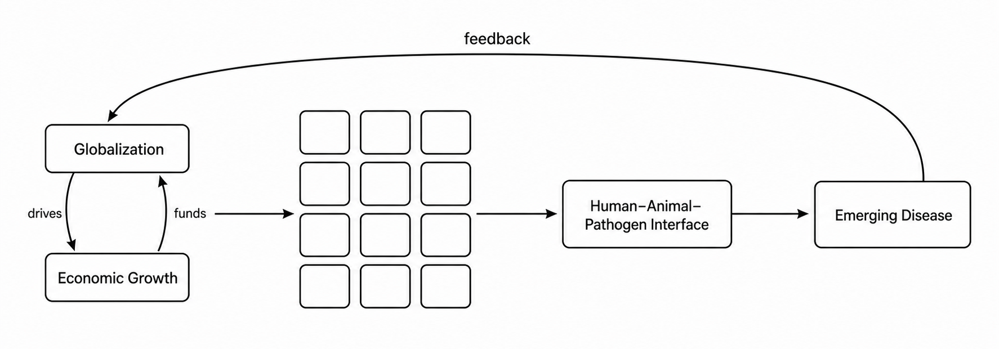{fig-align="center" height="420"}

Globalization and growth drive emergence through the twelve moments of the grid --- and a pandemic feeds back on the growth and connection that produced it, as 2020 made unforgettable.

::: {.notes}
So we can revise the basic model. Globalization and growth still drive one another in a reinforcing loop --- but now the loop's output is routed explicitly through the twelve moments and into the changing interface where disease emerges. And, crucially, a return arrow runs the other way: a pandemic feeds back on the growth and connection that produced it. The sixty-percent collapse in air travel in 2020 was that feedback made visible.

This is a simplification. What it does is tell us where to look and what to measure. When a new disease emerges, we can ask which moments are in play --- whose movement carried it, whose capital opened the ground it came from, whose institutions were funded to respond. The slogan "globalization spreads disease" gives one answer for every outbreak, which is to say no usable answer at all. The grid gives a different one each time.

[1.2 min | ends ~35:28]
:::

# Three near-pandemics {.divider}

::: {.notes}
*Let me show you what that looks like with three near-pandemics.*

[0.1 min | ends ~35:36]
:::

## Nipah: economic flows restructure ecology {.figure}

:::: {.columns}

::: {.column width="30%"}

Co-location of pig sty and mango trees, Ampang village, Malaysia --- the spillover interface built by agricultural investment.

Image: Chua et al. (2002) *Malaysian J. Pathology* 24: 15--21.

:::

::: {.column width="70%"}
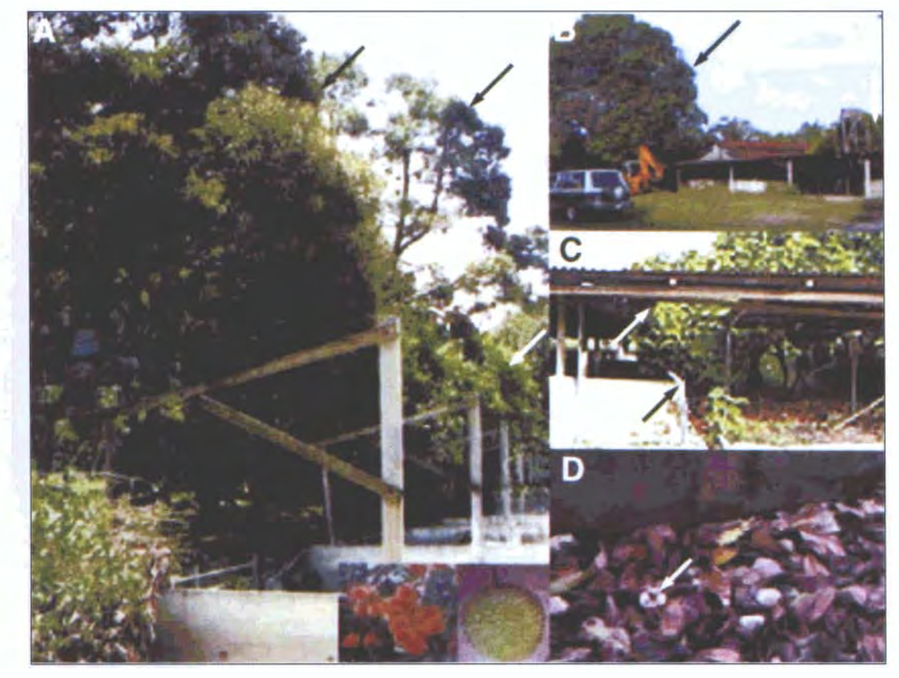{fig-align="center" height="540"}
:::

::::

::: {.notes}
Nipah virus has never caused a pandemic, but it has repeatedly come close --- and its emergence is one of the clearest demonstrations of how economic change, ecological disruption, mobility, and cultural practice combine.

Nipah was identified in 1999 during an outbreak of severe encephalitis among pig farmers in Malaysia. The virus is maintained by fruit bats and was almost certainly circulating long before its discovery. What changed in the 1990s was the landscape: rapid economic growth --- export agriculture, commercial pig production, extensive deforestation --- compressed wildlife, livestock, and humans into new spatial configurations. Forest loss pushed bats into cultivated orchards --- many planted, as in this photograph, directly beside high-density pig farms. Bats dropped contaminated fruit into pig enclosures; pigs amplified the virus; farmers were exposed. Case fatality was around forty percent; control required culling more than a million pigs; and pig traders moved the outbreak down the supply chain into Singapore.

Spillover did not stop there. Since 2001, Bangladesh and eastern India have had near-annual outbreaks with fatality rates often above seventy percent --- through a different route: consumption of raw date-palm sap contaminated by bats, a culturally embedded winter tradition. Human-to-human transmission now plays a substantial role.

Mapped onto the grid: investment and commerce in Malaysia; consumption practice and mobility in Bangladesh; land-use change and health-system strain in India. Emergence rarely results from a single mechanism --- it arises from interacting economic, ecological, cultural, and infrastructural processes.

[1.6 min | ends ~37:12]
:::

## Chikungunya: globalization as biological transport {.figure}

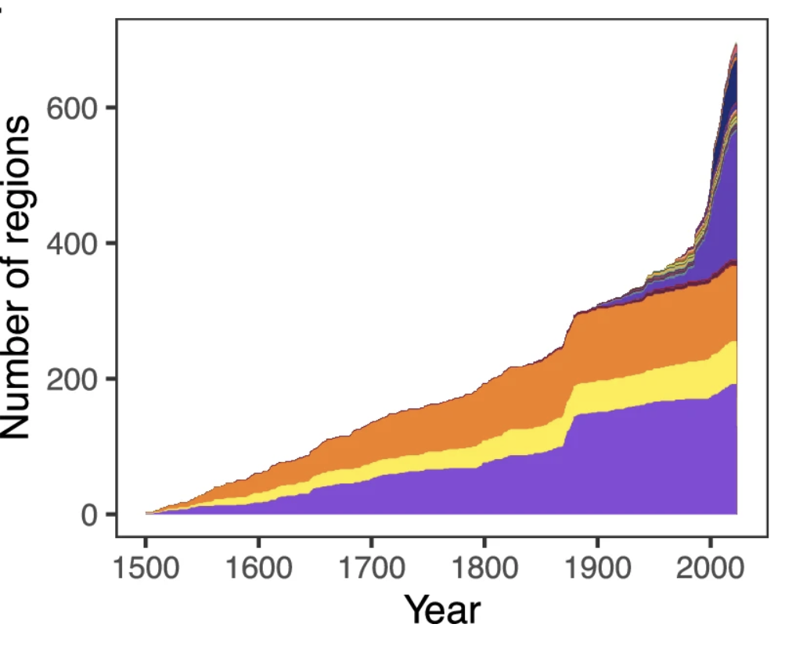{fig-align="center" height="400"}

Global introductions of *Aedes* vectors, 1500--2025: *Ae. albopictus* --- moved by trade in used tires and ornamental plants --- is now established on every inhabited continent. Sources: Swan et al. (2022) *Parasites & Vectors* 15: 303; Pabst et al. (2025) *Nature Communications* 16: 9127.

::: {.notes}
Here is the second case. Chikungunya virus causes abrupt fever and debilitating joint pain that can persist for months or years. It is transmitted by Aedes mosquitoes --- and its global expansion rode one of the best-documented biological invasions of the modern era.

Aedes albopictus spread from its native Asia to every inhabited continent, carried by international trade --- above all used tires and ornamental plants, in which its desiccation-resistant eggs survive long-distance transport. That expanding vector geography set the stage for an evolutionary event: during the 2005--2006 La Réunion epidemic, the virus acquired a mutation increasing its fitness in albopictus, allowing efficient transmission in temperate settings. The epidemic infected roughly a third of the island and seeded outbreaks across the Indian Ocean, India, Southeast Asia, Europe, and, from 2013, the Americas.

In the grid: goods and services moved the vector; investment and urbanization built its breeding habitat; people carried the virus into regions the vector had already colonized. Chikungunya never became a pandemic --- but its trajectory shows how globalization repeatedly generates the ecological opportunities that make pandemics possible.

[1.2 min | ends ~38:24]
:::

## SARS 2003: one hotel floor, three continents {.figure}

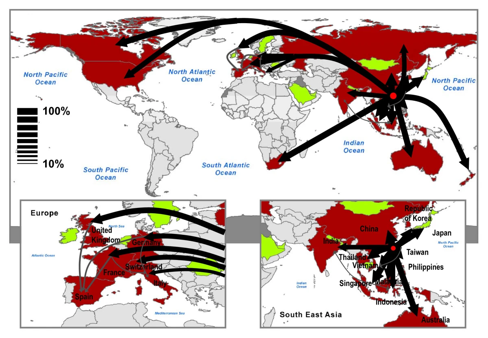{fig-align="center" height="400"}

The diffusion of SARS from Hong Kong in 2003 followed the airline network, not geography. Source: Colizza et al. (2007) *BMC Medicine* 5: 34.

::: {.notes}
Third case: the first global coronavirus epidemic of this century was not COVID-19. It was SARS, in 2003. The earliest clusters appeared in Guangdong in late 2002 among food handlers and workers exposed to market wildlife --- civets and raccoon dogs as intermediate hosts, horseshoe bats as the reservoir.

What made it international was the structure of commercial aviation. On the twenty-first of February 2003, a Guangdong physician, already ill, stayed one night on the ninth floor of the Metropole Hotel in Hong Kong. At least sixteen secondary infections were traced to that floor --- and several of those guests departed the next morning on flights to Hanoi, Singapore, and Toronto, seeding independent outbreaks on three continents.

By July 2003: 8,098 cases, 774 deaths, 29 countries --- modest by pandemic standards, yet the economic impact was thirty to forty billion dollars, driven by the collapse of travel and tourism. And the institutional consequences were larger still: SARS directly drove the strengthening of the International Health Regulations and the creation of the PHEIC mechanism --- the legal architecture we discussed at the start.

SARS demonstrated how early-twenty-first-century connectivity could turn a localized spillover into a multinational epidemic within days. Seventeen years later, on an even denser network, SARS-CoV-2 proved the point at scale.

[1.4 min | ends ~39:49]
:::

## Three cases, three configurations of the same grid

|  | Economic | Political | Cultural |
|---|---|---|---|
| **Goods & services** | Nipah · Chik | SARS | Nipah |
| **Capital** | Nipah · Chik |  |  |
| **People** | Nipah | SARS | Chik · SARS |
| **Ideas** |  | SARS |  |

### Different cells activate in different combinations --- emergence is configurational

::: {.notes}
Stepping back, the three cases together are revealing. Biologically they have almost nothing in common: a bat paramyxovirus amplified in pigs, a mosquito-borne alphavirus dispersed by an invasive vector, a coronavirus moved through hotels and airports. But mapped onto the grid, the underlying logic comes into focus.

Nipah is economic flows reorganizing ecological contact zones --- investment and commerce. Chikungunya is globalization as biological transport infrastructure --- trade moving the vector, people moving the virus. SARS is mobility meeting political institutions --- an airline network spreading infection, and information flows, delayed reporting, and evolving health regulations shaping both spread and control.

The pattern is not that one driver dominates. It is that different cells of the grid activate in different combinations --- outbreak-specific configurations of the same underlying architecture. Which leads to the central insight of the talk: pandemics are not statistical outliers or aberrations of nature. They are high-visibility manifestations of ordinary globalization processes.

[1.0 min | ends ~40:51]
:::

## Three regularities: coupling, acceleration, asymmetry

**Coupling** --- once-separate systems are now tightly linked: bat ecology with industrial livestock; mosquito ecology with shipping; wildlife trade with aviation

**Acceleration** --- connection is old; the *speed* of connection is unprecedented

**Asymmetry** --- shared exposure, unequal consequences: emergence in the periphery, response capacity in the core

::: {.notes}
Across the cases, three regularities.

Coupling. Each event originates at a junction where systems that once operated semi-independently have become tightly linked: bat ecology with industrial livestock production; mosquito ecology with global shipping; wildlife trade with international air travel. As couplings tighten, disturbances in one domain propagate into others.

Acceleration. Connection is not new --- but the speed of connection is. Mosquito eggs cross oceans in weeks; a single night on one hotel floor seeds outbreaks on three continents. Faster systems compress the window for detection and intervention --- which is precisely the window that law and institutions exist to hold open.

Asymmetry. Risk is structurally uneven. The mechanisms that generate emergence are not the ones that determine vulnerability. Emergence concentrates at the periphery's frontiers; vaccine manufacturing and fiscal capacity concentrate in the core. Globalization creates shared exposure but unequal consequences.

Coupling, acceleration, and asymmetry are the structural determinants of epidemics in the twenty-first century. Epidemics arrive not as random shocks but as system-level expressions of how the modern world is organized.

[1.1 min | ends ~41:58]
:::

# What follows {.divider}

::: {.notes}
*So what do we do with all of this? Let me close with what follows --- for analysis and for policy.*

[0.2 min | ends ~42:07]
:::

## From drivers to architecture

**From lists to configurations** --- the unit of analysis is the pattern of interaction, not the individual driver

**Match governance scale to system scale** --- nested, mutually reinforcing layers: local detection, national regulation, international coordination

**Intervene at leverage points** --- mobility networks, land-use regimes, supply chains, information flows

::: {.notes}
First: from drivers to configurations. The IOM reports and the outbreak databases give us lists. But in Nipah, chikungunya, and SARS, what mattered was never a single factor --- it was the configuration, the particular way ecological change, trade, travel, and information interacted in that setting. Analysis, and policy, should target the pattern of interaction.

Second: match governance scale to system scale. The same coordination problems recur at every level --- local detection, national regulation of land use and mobility, international coordination of information and collective action. Effective governance has to mirror that structure: multiple nested layers that reinforce one another, rather than a single global fix. The International Health Regulations failed in 2020 not because international law is hopeless, but because a single thin layer was asked to do the work of many.

Third: leverage points. The most promising interventions act on the infrastructures through which globalization operates --- mobility networks, land-use regimes, commodity supply chains, and the information flows that shape trust and response. These are the places where modest, well-designed changes alter the configurations that turn local spillovers into global crises. And nearly every one of them is, at bottom, an instrument of law and institutional design.

[1.4 min | ends ~43:30]
:::

## {background-image="figures/savannah-port.jpg" background-size="cover" background-position="center"}

::: {.frosted}
**The world we have built and the world we need**

Our world is one in which everything moves: people, capital, ideas --- and pathogens.

Pandemics are the wake of that motion.

Savannah Port, Georgia. Image: Wikimedia Commons (CC BY-SA 4.0)

:::

::: {.notes}
What I want to leave you with is not a prediction, but a reframing.

We have moved from the biology of spillover to the sociology of mobility, from ecological disruption to the political economy of global integration. The through-line is this: pandemics are not anomalies. They are expressions of the interconnected systems we inhabit --- sometimes catastrophic expressions, but structurally generated all the same.

A wake is not incidental. It is what a hull produces as it moves through water, and it grows with the vessel: the greater the mass and the faster the passage, the larger the wake it throws. Our world is a very large ship moving at ever-increasing speed --- dense mobility, planetary supply chains, accelerated capital, instantaneous information. Rapid pathogen emergence and spread are not aberrations. They are part of the wake.

So the policy question is not whether we can unwind globalization. We cannot --- and in many respects should not. The question is how to redesign global interdependence so that the forces that create vulnerability instead produce resilience. That requires institutions that detect weak signals and act before cascades begin; sectors --- finance, agriculture, trade --- that internalize ecological and epidemiological intelligence rather than externalizing it; and multilayered coordination operating at local, national, and international scales at once. Preparedness is not a technical add-on of stockpiles and surveillance. In a world where everything moves, preparedness is an architectural principle.

If pandemics are the wake of globalization, resilience lies in the design of the hull --- because we cannot stop the ship.

Thank you.

[1.6 min | ends ~45:04]
:::

# Additional materials {.divider}

## The 1977 "Russian flu" and laboratory biosecurity

An H1N1 strain almost genetically identical to 1950s viruses re-emerged simultaneously in the USSR and northern China

Genetic uniformity and absence of natural evolution strongly suggest accidental release from a laboratory or vaccine trial

The policy lesson stands apart from the COVID origins debate: as bioscience globalizes, laboratory risk globalizes with it

::: {.notes}
The 1977 H1N1 re-emergence is the clearest documented case of a probable research-related pandemic strain. Its genetic near-identity to viruses that circulated two decades earlier is inconsistent with natural circulation. The governance point: expanding global laboratory capacity means biosafety and biosecurity are now transnational regulatory problems --- dual-use research oversight, the Biological Weapons Convention's verification gap, and the unresolved COVID origins debate all live here.
:::

## The economics of prevention at the source

Dobson et al. (2020, *Science*): $20--30B/yr in forest conservation and wildlife-trade regulation vs. trillions in pandemic losses

Vora et al. (2022, *Nature*): embed forest protection in the G20 pandemic fund, WHO pandemic agreement, CBD framework

Caveat: prevention at the source addresses *certain classes* of spillover --- especially bat-associated viruses --- not the full pandemic portfolio

::: {.notes}
The cost-benefit case for source-side prevention is genuinely strong for bat-associated spillover at deforestation frontiers. The caution from the main talk applies: most historical pandemics ran through agricultural, urban, and mobility channels that forest conservation would not have touched. A balanced portfolio funds both the frontier and the system.
:::

## Access, not hesitancy

Solís Arce et al. (2021, *Nature Medicine*): across 15 low- and middle-income countries, vaccine acceptance exceeded the U.S. benchmark

Sierra Leone (Meriggi et al. 2024, *Nature*): reaching a vaccination point cost ~3.5 hours travel each way and 10--12 days' income

Mobile delivery teams raised uptake dramatically at competitive cost per dose

::: {.notes}
Mobarak's two studies dismantle the "hesitancy" explanation for global vaccine inequity. Willingness was higher in every low- and middle-income sample than in the United States; the binding constraint was the time and money cost of access. When the barrier was removed --- nurses and doses driven into remote villages --- uptake climbed immediately. The dose withheld and the dose that cannot be reached come to the same empty arm.
:::

## PHEIC declarations to date {.figure}

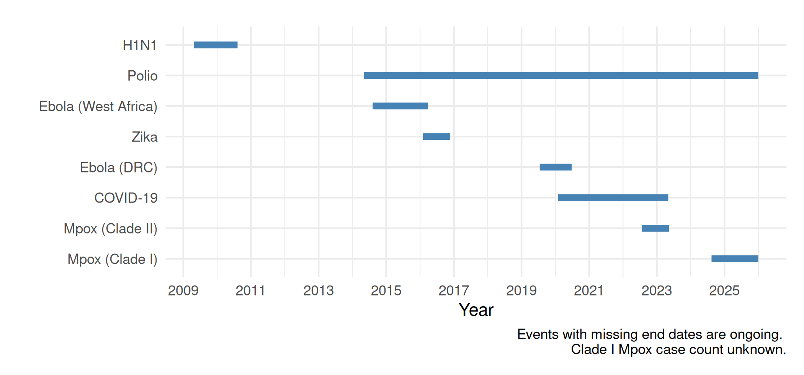{fig-align="center" height="420"}

Timeline and duration of the eight Public Health Emergencies of International Concern declared through 2025; a ninth --- Ebola in the DRC --- was declared in 2026.

::: {.notes}
Nine declarations under the 2005 International Health Regulations. Notable for a law audience: the DG's discretion, the absence of enforcement or verification powers, the 2024 IHR amendments, and the pandemic accord negotiations.
:::

